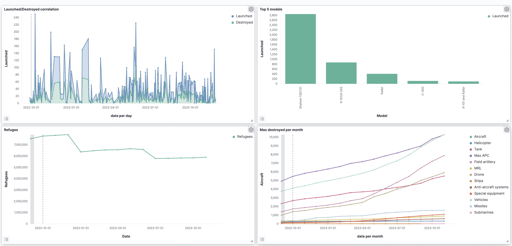
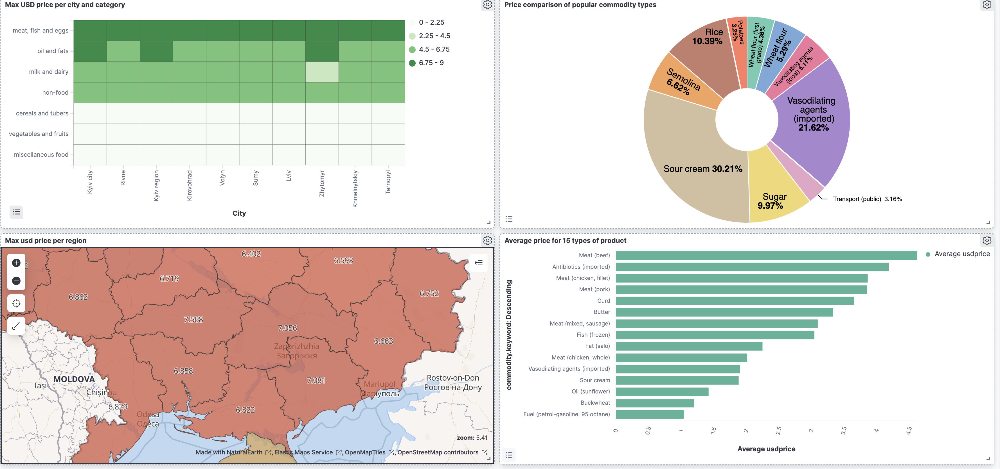

Keywords: Elastic search, Kibana, Scala, Data Preprocessing, Open Data

# War in Ukraine/Food prices in Ukraine 

## Dataset Description

I have several datasets: food prices in Ukraine since 2014, records of terrorist rocket attacks on Ukraine, the number of refugees fleeing to Europe, and Russian losses in personnel and equipment.

The datasets on Russian losses and rocket attacks are based on reports from the Armed Forces of Ukraine. The refugee dataset is provided by data2.unhcr.org and is based on open data from the European Union. The food prices dataset is sourced from https://data.humdata.org. This dataset contains data on food prices in Ukraine, originating from the World Food Programme's food price database. The World Food Programme's price database covers foods such as maize, rice, beans, fish, and sugar for 98 countries and approximately 3,000 markets.

## Resources

https://www.kaggle.com/datasets/piterfm/2022-ukraine-russian-war

https://www.kaggle.com/datasets/hskhawaja/russia-ukraine-conflict

https://data.humdata.org/dataset/wfp-food-prices-for-ukraine

https://data.humdata.org/dataset/ukraine-refugee-situation

https://data2.unhcr.org/en/situations/ukraine

## Data Format
All datasets were deliberately selected in CSV format. They all share a common date column, which allows for easy joins. A comma (",") delimiter is used in all documents, which facilitated the data parsing process.

## Data Modifications
Spark was used for data preprocessing, running a script written in Scala. The food prices dataset contained monthly data from 2014 to 2023. The other datasets related to the war in Ukraine had data almost daily from 2022. To create a good visualization and maintain data consistency, I decided to merge all the CSV files except for the food prices dataset and limit the data from August 28, 2022, to November 29, 2023. The food prices data were limited to the period from March 15, 2014, to February 15, 2022, which allows tracking the economic situation before the massive invasion. The script outputted two CSV files (food_prices, merged_data), which automatically landed in the Logstash folder. In Logstash, two pipelines were defined to send data to Elasticsearch. Conf and template files were also defined. The conf files filter the columns that make it into the final index, automatically create a "location" field from the "latitude" and "longitude" fields, and set the correct data types for integer and float columns. The json template files describe the rules for proper data mapping.

## Conclusion
During the semester project, I found good datasets related to the war in Ukraine and food prices. I created a project that can automatically perform data preprocessing and send this data directly to Elasticsearch using Logstash. I successfully created 8 different types of visualizations that cover all the data I had.
